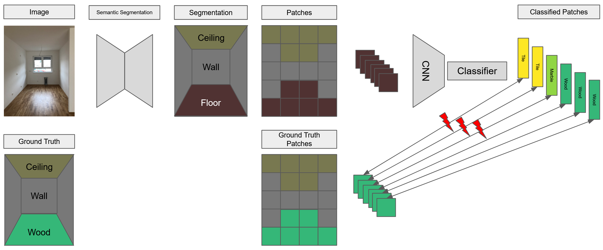

# Material Classification in Construction Sites
Codebase for our course in the WS2020/2021 at the CV:HCI at Karlsruhe Institute of Technology

[Moritz Ritzl](https://github.com/m0ritzl), 
[Laurenz Thiel](https://github.com/lrnzthl) 

### Table of Contents
1. [Abstract](#abstract)
2. [Requirements and Dependencies](#requirements-and-dependencies)
3. [Datasets](#datasets)
4. [Trained Models](#trained-models)

### Abstract
Computer vision is being used in more and more areas of our life.
However, it is still underrepresented in construction site contexts.
But there are many possible applications in this area, for example, to automatically monitor the construction process and, thus, potentially improve efficiency.
One possibility is to estimate the construction status based on the materials visible in a certain phase of construction.
For example, the floor is initially made of concrete and will then be covered with wood in a later step.
To monitor this progress, it is sufficient to take photographs of the construction site.
These can then be analyzed in more detail.
For this purpose, a pipeline was developed and implemented within the scope of this work.
It uses a photograph of the construction site as input.
The image is then segmented with respect to the spatial components of the room, which makes it possible to subsequently classify the material on the ground and, thus, obtain an approximation of the distribution of the materials used.
The segmentation and classification are done with different CNNs.
These were trained using different public datasets (ADE20k, OpenSurfaces, and MINC-2500).
For testing, an own dataset, which consists of construction site images, was annotated.
The results show that the segmentation works very well, but that there is still room for improvement in the classification.

### Requirements and Dependencies
- PyTorch 
- for details see `requirements.txt`

### Datasets
Download the MINC-2500 and our own OpenSurfaces subset to the to datasets folder:\
MINC-2500: http://opensurfaces.cs.cornell.edu/publications/minc/ \
OpenSurfaceSubset: https://bwsyncandshare.kit.edu/s/FMZgW8Qtg333S2f \
Our own labeled test dataset can be found under: https://bwsyncandshare.kit.edu/s/ACq9sDSnJ8NZnZ5 

### Trained Models
Our trained models are available under: https://bwsyncandshare.kit.edu/s/ai5eYf2SPNbHTRm
